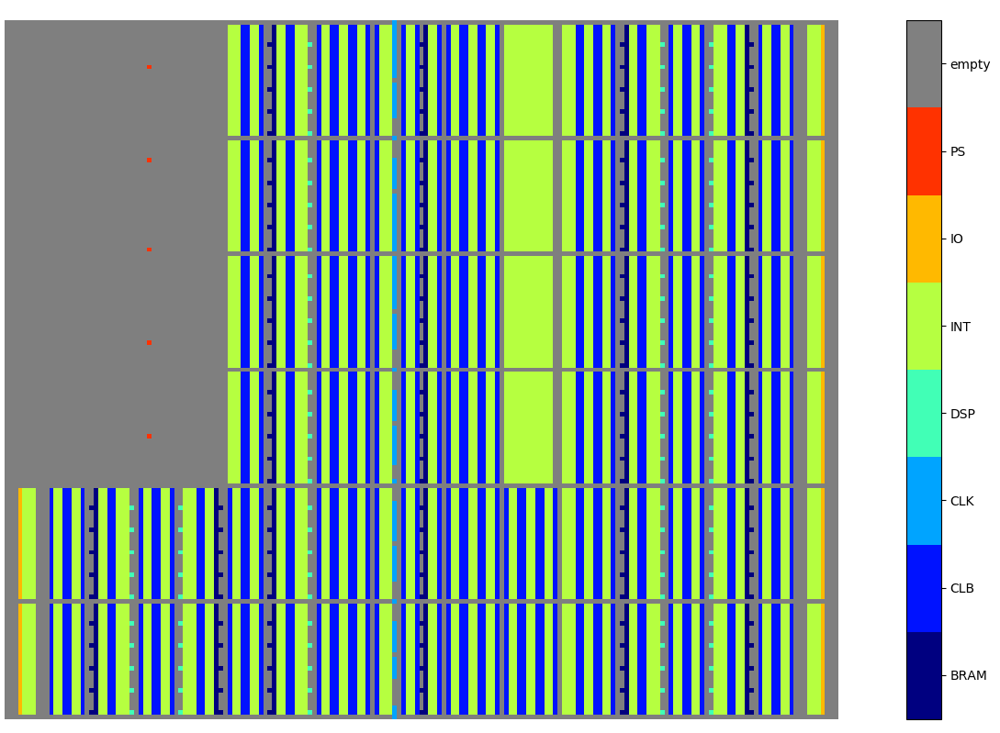
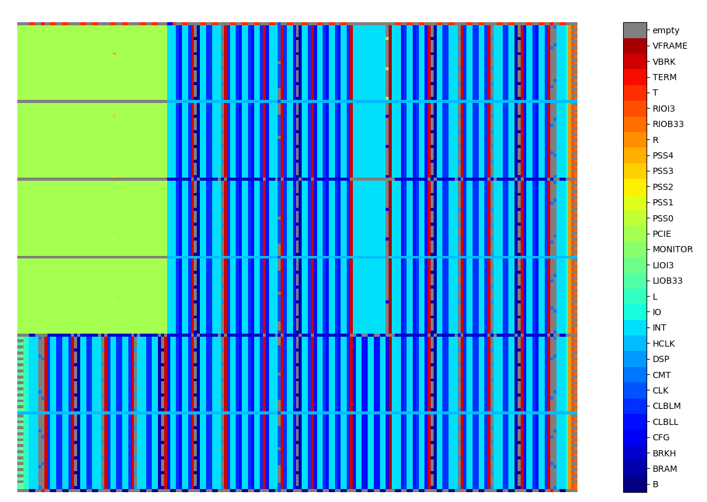
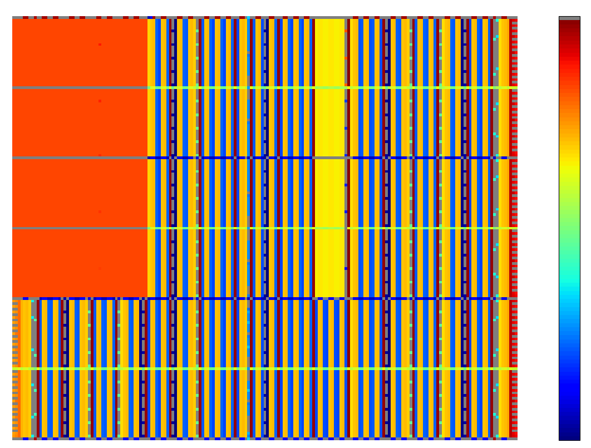

# FPGA-resource-visualization
With a FPGA resource information extracted from Xilinx Vivado, the code visualizes resource map.

Three versions are available: __1)main tile types, 2)concise, 3)verbose__.
You can change the setting in the SETTING comment block in the code.

## Resource Visualization for Main Tile Types

## Resource Visualization for Concise Ver.

## Resource Visualization for Detailed Ver.

