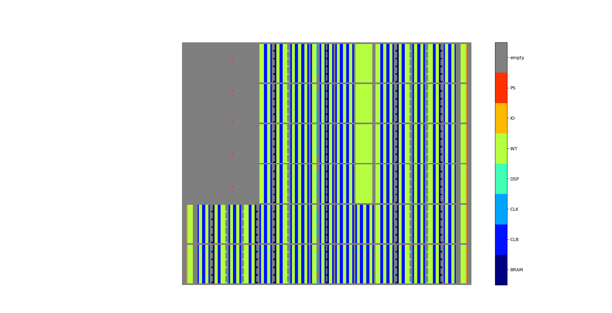
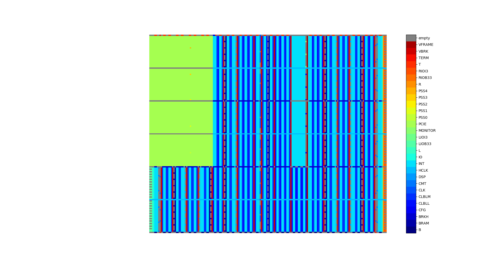
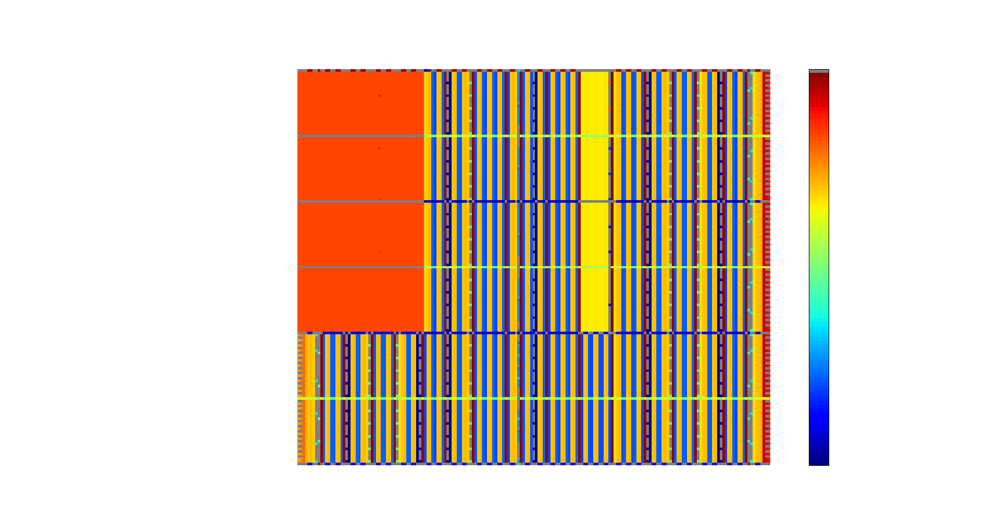

# FPGA-resource-visualization
With a FPGA resource information extracted from Xilinx Vivado, the code visualizes resource map.

Three versions are available: __1)mainTypes, 2)concise, 3)verbose__.

## Resource Visualization for Main Tile Types

## Resource Visualization for Concise Ver.

## Resource Visualization for Detailed Ver.

